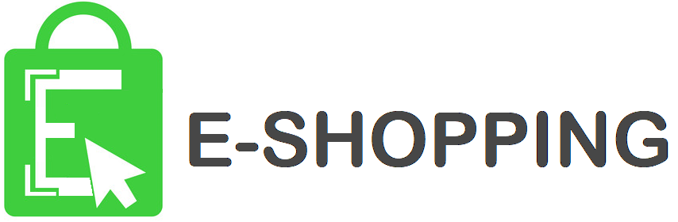

<p align="center"></p>

“Ứng dụng bán hàng online eShopping” ra đời nhằm phục vụ cho nhu cầu mua sắm của người tiêu dùng cũng như nhu cầu tìm kiếm 1 platform để bán các sản phẩm của các shop đang và sắp đi vào hoạt động. Ứng dụng giúp cho việc mua và bán của 2 bên trở nên đơn giản và dễ dàng hơn, từ đó tiết kiệm được một số khoản chi phí không cần thiết.

## Tính năng chính

* Đăng nhập và đăng ký khách hàng
* Xem danh sách danh mục và bộ lọc tìm kiếm
* Xem thông tin chi tiết loại sản phẩm và sản phẩm
* Đặt hàng, thêm thông tin và tiến hành thanh toán

## Screenshots

* [Đăng ký](pics/Dangky.png)
* [Màn hình chính](pics/Manhinhchinh.png)
* [Màn hình sản phẩm](pics/Sanpham.png)
* [Quy trình mua hàng](pics/Muahang.png)

## Cài đặt

#### Build source
```bash
$ git clone --recursive https://github.com/tungphan311/MyCam
```

#### Hoặc download file apk tại [đây](apk/eShopping.apk).

## Môi trường phát triển

* Ngôn ngữ lập trình: Java
* Hệ quản trị cơ sở dữ liệu: MySQL
* Truy vấn dữ liệu: PHP
* IDE: Android Studio

## Tổ chức mã nguồn

#### Package Activity
* Chứa các activity của chương trình.
#### Package Adapter
* Chứa các bản vẽ của chương trình, chủ yếu sử dụng cho listview hoặc recyclerview.
#### Package Fragment
* Chứa các fragment, là các giao diện nhỏ cùng nằm trên 1 activity.
#### Package Model
* Chứa các class lưu thông tin của các bảng trong database. 
#### Package Util
* Chứa các class sử dụng xuyên suốt chương trình.

## Tổng kết

### Nhận xét và đánh giá
* Trong quá trình làm việc nhóm và xây dựng sản phẩm, nhóm đã đạt được:
    1.	Khả năng làm việc nhóm, phân chia công việc và quản lý tiến độ
    2.	Tiếp thu với kiến thức mới
    3.	Giúp đỡ, hỗ trợ lẫn nhau để cùng hoàn thiện sản phẩm
* Tuy đã hoàn thiện các chức năng cơ bản, ứng dụng vẫn còn nhiều điểm có thể cải tiến để nâng chất chất lượng sản phẩm cũng như trải nghiệm của người dùng:
    1.	Cải thiện, nâng cao mảng UI/UX
    2.	Cải thiện tính tiến hoá của ứng dụng
    3.	Thêm một số tính năg:
        - Nhập code giảm giá
        - Thêm nút yêu thích cho sản phẩm => Thêm mục sản phẩm yêu thích cho khách hàng
        - Thêm phần cài đặt, cho phép người dùng đổi ngôn ngữ (Tiếng Anh), đổi màu nền, phông chữ, …
    4.	Mở rộng dữ liệu người dùng, liên kết với các nền tảng khác:
        - Thanh toán bằng thẻ ATM, thẻ VISA và Mastercard,…
        - Đăng nhập bằng mạng xã hội Facebook, Google

### Phân chia công việc
| Màn hình                                           | Thời gian (ngày) | Thực hiện         |
|----------------------------------------------------|------------------|-------------------|
| Màn hình “Trang chủ”                               | 5                | Tùng,  
| Màn hình “Danh mục”                                | 5                | Tùng, Hoàng
| Màn hình “Giỏ hàng”                                | 5                | Hoàng, Luân
| Màn hình “Thêm”                                    | 5                | Tùng, Hoàng
| Màn hình chi tiết cho từng loại sản phẩm           | 2                | Tùng, Luân
| Màn hình thông tin chi tiết sản phẩm               | 2                | Tùng
| Màn hình mua hàng                                  | 5                | Tùng, Hoàng
|   1. Màn hình địa chỉ                              | 2                | Tùng, Luân
|   2. Màn hình thêm địa chỉ                         | 2                | Tùng, Luân
|   3. Màn hình thanh toán                           | 2                | Hoàng, Luân
|   4. Màn hình xác nhận                             | 2                | Hoàng, Luân
| Màn hình đăng nhập, đăng ký                        | 6                | Tùng
| Màn hình trợ giúp, cài đặt, giới thiệu, chính sách | 3                | Tùng
| Màn hình thanh toán thành công                     | 2                | Hoàng
| Màn hình “Đơn hàng của tôi”                        | 3                | Hoàng

## Tài liệu tham khảo

* [Blog chia sẻ kiến thức của Thầy Trần Duy Thanh](https://duythanhcse.wordpress.com/)
* [Kênh youtube Trung tâm đào tạo tin học Khoa phạm](https://www.youtube.com/channel/UCX1g7Ciyjv6pFeX7EhvX4sQ)
* [Hướng dẫn truy xuất thông tin từ nhiều bảng bằng PHP](https://www.youtube.com/watch?v=R2yBftqWIZM&t=1389sfbclid=IwAR2MOiTAOOCZNfDm7NKXBsuQzu3ZOe7Hz4g0vZnmjW4V8OKQ70mIZ0_mpUk)
* [Hướng dẫn sử dụng thư viện SharePreferences](https://www.youtube.com/watch?v=R2yBftqWIZM&t=1389sfbclid=IwAR2MOiTAOOCZNfDm7NKXBsuQzu3ZOe7Hz4g0vZnmjW4V8OKQ70mIZ0_mpUk)


